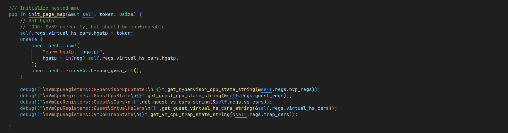

# hypercraft RISC-V练习

## 练习1
1. 在arceos中运行linux
2. （1）阅读[The RISC-V Instruction Set Manual Volume II: Privileged Architecture](https://drive.google.com/file/d/1EMip5dZlnypTk7pt4WWUKmtjUKTOkBqh/view) Chapter 8(8.1)Privilege Modes，回答RISCV引入虚拟化扩展后，其特权模式有哪些新的变化，各模式之间存在什么关系与区别。（2）请问Hypercraft是哪一种hypervisor。


1.运行成功


2.

（1）S-mode变为了HS-mode，U-mode变为VS-mode和VU-mode。其中gust OS运行在VS-mode上。HS-mode运行hypervisor或者OS，与硬件交流和原本的S-mode差不多。需要向上面的VS-mode提供SBI。

（2）属于type-2的hypervisor，运行在arceos上面，由hv app使用。

## 练习2
1. 在合适的地方修改代码，打印出在vcpu初始化前后VmCpuRegisters各个部分寄存器的值。比较它们哪些值发生了变化。并根据本章节介绍的内容，对照[The RISC-V Instruction Set Manual Volume II: Privileged Architecture](https://drive.google.com/file/d/1EMip5dZlnypTk7pt4WWUKmtjUKTOkBqh/view)，说明值变化的寄存器的作用。

在这些地方增加了输出：





增加输出的函数是让chatgpt帮我写的。

输出如下：

```
[  0.044363 0 hypercraft::arch::vcpu:230] 
VmCpuRegisters::HypervisorCpuState:
 General Purpose Registers:
Zero: 0
RA: 0
SP: 0
GP: 0
TP: 0
T0: 0
T1: 0
T2: 0
S0: 0
S1: 0
A0: 0
A1: 0
A2: 0
A3: 0
A4: 0
A5: 0
A6: 0
A7: 0
S2: 0
S3: 0
S4: 0
S5: 0
S6: 0
S7: 0
S8: 0
S9: 0
S10: 0
S11: 0
T3: 0
T4: 0
T5: 0
T6: 0
sstatus: 0
hstatus: 0
scounteren: 0
stvec: 0
sscratch: 0

[  0.046246 0 hypercraft::arch::vcpu:231] 
VmCpuRegisters::GuestCpuState
General Purpose Registers:
Zero: 0
RA: 0
SP: 0
GP: 0
TP: 0
T0: 0
T1: 0
T2: 0
S0: 0
S1: 0
A0: 0
A1: 0
A2: 0
A3: 0
A4: 0
A5: 0
A6: 0
A7: 0
S2: 0
S3: 0
S4: 0
S5: 0
S6: 0
S7: 0
S8: 0
S9: 0
S10: 0
S11: 0
T3: 0
T4: 0
T5: 0
T6: 0
sstatus: 0
hstatus: 0
scounteren: 0
sepc: 0

[  0.048017 0 hypercraft::arch::vcpu:232] 
VmCpuRegisters::GuestVsCsrs
htimedelta: 0
vsstatus: 0
vsie: 0
vstvec: 0
vsscratch: 0
vsepc: 0
vscause: 0
vstval: 0
vsatp: 0
vstimecmp: 0

[  0.048925 0 hypercraft::arch::vcpu:233] 
VmCpuRegisters::GuestVirtualHsCsrs
hie: 0
hgeie: 0
hgatp: 0

[  0.049579 0 hypercraft::arch::vcpu:234] 
VmCpuRegisters::VmCpuTrapState
scause: 0
stval: 0
htval: 0
htinst: 0

[  0.050199 0 hypercraft::arch::vcpu:258] 
VmCpuRegisters::HypervisorCpuState:
 General Purpose Registers:
Zero: 0
RA: 0
SP: 0
GP: 0
TP: 0
T0: 0
T1: 0
T2: 0
S0: 0
S1: 0
A0: 0
A1: 0
A2: 0
A3: 0
A4: 0
A5: 0
A6: 0
A7: 0
S2: 0
S3: 0
S4: 0
S5: 0
S6: 0
S7: 0
S8: 0
S9: 0
S10: 0
S11: 0
T3: 0
T4: 0
T5: 0
T6: 0
sstatus: 0
hstatus: 0
scounteren: 0
stvec: 0
sscratch: 0

[  0.051867 0 hypercraft::arch::vcpu:259] 
VmCpuRegisters::GuestCpuState
General Purpose Registers:
Zero: 0
RA: 0
SP: 0
GP: 0
TP: 0
T0: 0
T1: 0
T2: 0
S0: 0
S1: 0
A0: 0
A1: 10010000000000000000000000000000
A2: 0
A3: 0
A4: 0
A5: 0
A6: 0
A7: 0
S2: 0
S3: 0
S4: 0
S5: 0
S6: 0
S7: 0
S8: 0
S9: 0
S10: 0
S11: 0
T3: 0
T4: 0
T5: 0
T6: 0
sstatus: 1000000000000000000000000000001000000000000000000110000100000000
hstatus: 1000000000000000000000000110000000
scounteren: 0
sepc: 10010000001000000000000000000000

[  0.053901 0 hypercraft::arch::vcpu:260] 
VmCpuRegisters::GuestVsCsrs
htimedelta: 0
vsstatus: 0
vsie: 0
vstvec: 0
vsscratch: 0
vsepc: 0
vscause: 0
vstval: 0
vsatp: 0
vstimecmp: 0

[  0.054699 0 hypercraft::arch::vcpu:261] 
VmCpuRegisters::GuestVirtualHsCsrs
hie: 0
hgeie: 0
hgatp: 0

[  0.055212 0 hypercraft::arch::vcpu:262] 
VmCpuRegisters::VmCpuTrapState
scause: 0
stval: 0
htval: 0
htinst: 0

[  0.056107 0 hypercraft::arch::vcpu:285] 
VmCpuRegisters::HypervisorCpuState:
 General Purpose Registers:
Zero: 0
RA: 0
SP: 0
GP: 0
TP: 0
T0: 0
T1: 0
T2: 0
S0: 0
S1: 0
A0: 0
A1: 0
A2: 0
A3: 0
A4: 0
A5: 0
A6: 0
A7: 0
S2: 0
S3: 0
S4: 0
S5: 0
S6: 0
S7: 0
S8: 0
S9: 0
S10: 0
S11: 0
T3: 0
T4: 0
T5: 0
T6: 0
sstatus: 0
hstatus: 0
scounteren: 0
stvec: 0
sscratch: 0

[  0.057725 0 hypercraft::arch::vcpu:286] 
VmCpuRegisters::GuestCpuState
General Purpose Registers:
Zero: 0
RA: 0
SP: 0
GP: 0
TP: 0
T0: 0
T1: 0
T2: 0
S0: 0
S1: 0
A0: 0
A1: 10010000000000000000000000000000
A2: 0
A3: 0
A4: 0
A5: 0
A6: 0
A7: 0
S2: 0
S3: 0
S4: 0
S5: 0
S6: 0
S7: 0
S8: 0
S9: 0
S10: 0
S11: 0
T3: 0
T4: 0
T5: 0
T6: 0
sstatus: 1000000000000000000000000000001000000000000000000110000100000000
hstatus: 1000000000000000000000000110000000
scounteren: 0
sepc: 10010000001000000000000000000000

[  0.059778 0 hypercraft::arch::vcpu:287] 
VmCpuRegisters::GuestVsCsrs
htimedelta: 0
vsstatus: 0
vsie: 0
vstvec: 0
vsscratch: 0
vsepc: 0
vscause: 0
vstval: 0
vsatp: 0
vstimecmp: 0

[  0.060572 0 hypercraft::arch::vcpu:288] 
VmCpuRegisters::GuestVirtualHsCsrs
hie: 0
hgeie: 0
hgatp: 1000000000000000000000000000000000000000000010000000001010001100

[  0.061338 0 hypercraft::arch::vcpu:289] 
VmCpuRegisters::VmCpuTrapState
scause: 0
stval: 0
htval: 0
htinst: 0
```

主要变化是GuestCpuState的变化，GuestCpuState在进入虚拟化的时候要被恢复，所以初次启动要设置一些初始值。

hstatus的7,8两位代笔爱了SPV和SPVP。

SPV表示在进入HS-mode前，virtualization mode V的值。启动大概类似于一个从trap中恢复的过程，所以V的值会在第一次进入虚拟化的值被设置为此时设置的SPV初始值也就是1。

SPVP用于恢复到VS-mode还是VU-mode，此处的值为1代表恢复到VS-mode，用于正确启动linux。

第33，32两位用于表示VSXLEN的大小，这里的值为10表明虚拟的CPU也是64位的。

sstatus用于初始化vcpu的sstatus值供guest os使用。

sepc是程序的入口。

a0和a1分别根据linux的约定保存当前hart id和dtb。

hgatp保存了页表的信息，用于二段地址翻译（内存虚拟化还没学。


## 练习3

1. 参考[The RISC-V Instruction Set Manual Volume II: Privileged Architecture](https://drive.google.com/file/d/1EMip5dZlnypTk7pt4WWUKmtjUKTOkBqh/view) Chapter 8(8.6) Traps，分析RISCV版本的Hypercraft存在哪些异常类型，这些异常从触发到处理完成分别经过怎样的特权级别的切换，会涉及到哪些寄存器的设置。


查看vcpu.run中的代码可得：

```
 match scause.cause() {
            Trap::Exception(Exception::VirtualSupervisorEnvCall) => {
                let sbi_msg = SbiMessage::from_regs(regs.guest_regs.gprs.a_regs()).ok();
                VmExitInfo::Ecall(sbi_msg)
            }
            //.....
        }
```

根据scause获取trap的类型。

Trap，Exception，Interrupt的定义在scause.rs中：

```
/// Trap Cause
#[derive(Copy, Clone, Debug, Eq, PartialEq)]
pub enum Trap {
    Interrupt(Interrupt),
    Exception(Exception),
}

/// Interrupt
#[derive(Copy, Clone, Debug, Eq, PartialEq)]
pub enum Interrupt {
    UserSoft,
    VirtualSupervisorSoft,
    SupervisorSoft,
    UserTimer,
    VirtualSupervisorTimer,
    SupervisorTimer,
    UserExternal,
    VirtualSupervisorExternal,
    SupervisorExternal,
    Unknown,
}

/// Exception
#[derive(Copy, Clone, Debug, Eq, PartialEq)]
pub enum Exception {
    InstructionMisaligned,
    InstructionFault,
    IllegalInstruction,
    Breakpoint,
    LoadFault,
    StoreMisaligned,
    StoreFault,
    UserEnvCall,
    VirtualSupervisorEnvCall,
    InstructionPageFault,
    LoadPageFault,
    StorePageFault,
    InstructionGuestPageFault,
    LoadGuestPageFault,
    VirtualInstruction,
    StoreGuestPageFault,
    Unknown,
}
```

但是根据代码，Interrupt只处理了：SupervisorTimer，SupervisorExternal。

Exception只处理了：LoadGuestPageFault，StoreGuestPageFault，VirtualSupervisorEnvCall。


## 练习4

16次，和老师合同学交流了很多。


## 练习5


修改上面几样就成功了。


