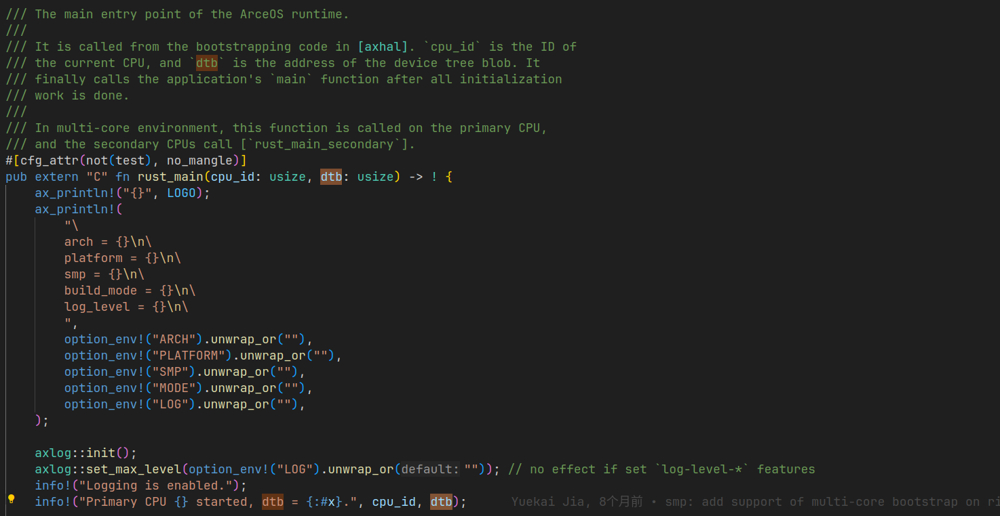
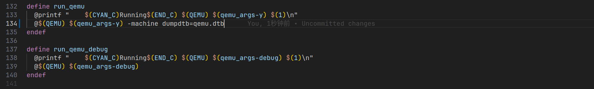
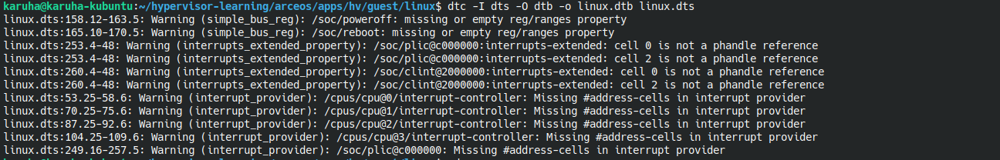
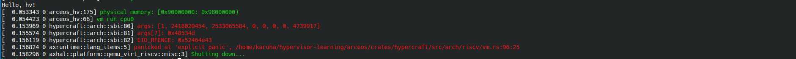
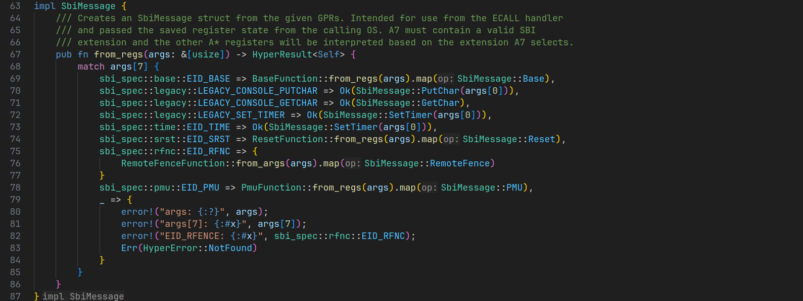

# 多核支持开发文档

## arceos hypercraft多核启动

过程省略，结论是，主核会去运行hv的main函数，其他核会运行：

```
    #[cfg(not(feature = "multitask"))]
    loop {
        axhal::arch::wait_for_irqs();
    }
```

在riscv中他是：

```
#[inline]
pub fn wait_for_irqs() {
    unsafe { riscv::asm::wfi() }
}

```

貌似在等待中断，后续应该要通过中断来启动其他物理CPU。


## 从dtb获取cpu信息

现在的物理核心数目是被直接写成1的，但是有前辈留下的todo，实现多核支持的花应该从dtb中获取信息吧。

```
// TODO: get cpu info by device tree
        let cpu_nums: usize = 1;
```

查看axruntime的rust_main好像根本没有用到dtb。



查找dtb只有这四个地方，也没有传到hv里面，可能要改hv的main函数？

但是guest os的dtb也要对应修改才行。

```
	cpus {
		#address-cells = <0x01>;
		#size-cells = <0x00>;
		timebase-frequency = <0x989680>;

		cpu@0 {
			phandle = <0x01>;
			device_type = "cpu";
			reg = <0x00>;
			status = "okay";
			compatible = "riscv";
			riscv,isa = "rv64ima";
			mmu-type = "riscv,sv39";

			interrupt-controller {
				#interrupt-cells = <0x01>;
				interrupt-controller;
				compatible = "riscv,cpu-intc";
				phandle = <0x02>;
			};
		};

		cpu-map {

			cluster0 {

				core0 {
					cpu = <0x01>;
				};
			};
		};
	};

```

linux.dts看起来貌似只有一个核心。所以guest os的dtb也要对应修改，有根据平台核心数量的不同而更改的办法吗？

（简便起见是不是留着这个todo然后把cpu_nums改成2或者5之类的数字也没问题?


## 修改linux.dtb

为了让guest os感知到多核需要修改linux.dtb。

根据老师的建议修改一下qemu.mk



在末尾添加一下 “-machine dumpdtb=qemu.dtb”。

然后`make ARCH=riscv64 A=apps/hv HV=y LOG=info SMP=4 run`添加`SMP=4`，

试着添加一下CPU：

```
	cpus {
		#address-cells = <0x01>;
		#size-cells = <0x00>;
		timebase-frequency = <0x989680>;

		cpu@0 {
			phandle = <0x01>;
			device_type = "cpu";
			reg = <0x00>;
			status = "okay";
			compatible = "riscv";
			riscv,isa = "rv64ima";
			mmu-type = "riscv,sv39";

			interrupt-controller {
				#interrupt-cells = <0x01>;
				interrupt-controller;
				compatible = "riscv,cpu-intc";
				phandle = <0x02>;
			};
		};

		cpu@1 {
			phandle = <0x05>;
			device_type = "cpu";
			reg = <0x01>;
			status = "okay";
			compatible = "riscv";
			riscv,isa = "rv64ima";
			mmu-type = "riscv,sv39";

			interrupt-controller {
				#interrupt-cells = <0x01>;
				interrupt-controller;
				compatible = "riscv,cpu-intc";
				phandle = <0x06>;
			};
		};

		cpu@2 {
			phandle = <0x07>;
			device_type = "cpu";
			reg = <0x02>;
			status = "okay";
			compatible = "riscv";
			riscv,isa = "rv64ima";
			mmu-type = "riscv,sv39";

			interrupt-controller {
				#interrupt-cells = <0x01>;
				interrupt-controller;
				compatible = "riscv,cpu-intc";
				phandle = <0x08>;
			};
		};

		cpu@3 {
			phandle = <0x09>;
			device_type = "cpu";
			reg = <0x03;
			status = "okay";
			compatible = "riscv";
			riscv,isa = "rv64ima";
			mmu-type = "riscv,sv39";

			interrupt-controller {
				#interrupt-cells = <0x01>;
				interrupt-controller;
				compatible = "riscv,cpu-intc";
				phandle = <0x0A>;
			};
		};


		cpu-map {

			cluster0 {

				core0 {
					cpu = <0x01>;
				};

				core1 {
					cpu = <0x05>;
				};

				core2 {
					cpu = <0x07>;
				};

				core3 {
					cpu = <0x09>;
				};
			};
		};
	};
```

编译获得一堆警告，无视警告继续执行。



出现个报错：



查看源代码得知是无法生成对应的sbi message，需要处理hart start的sbi




## 多个vcpu的初始化

我太菜了，所以先整两个cpu。

### secondary_main()

main()函数里面做了这些事情：

- 初始化PerCpu()
- 创建vcpu
- 创建vm
- 创建页表
- vm.run
- 目前我所做的是一个vcpu对应一个物理核心，思路是每个物理cpu创建自己的vcpu添加到vm里面。

所以需要把vm变成static的。

```
use lazy_init::LazyInit;

static mut HS_VM: LazyInit<VM<HyperCraftHalImpl, GuestPageTable>> = LazyInit::new();

use core::sync::atomic::{AtomicUsize, Ordering};

static INITED_VCPUS: AtomicUsize = AtomicUsize::new(0);
```

模仿arceos定义INITED_VCPUS来记录已经初始化了的cpu，以同步主核和副核的初始化。

在axruntime里面添加secondary_main()的代码：

```
    #[cfg(feature = "hv")]
    unsafe {
        secondary_main(cpu_id);
    }
```

并在secondary_main()里面完成初始化操作。

### 同步

主核和副核的初始化需要同步，具体为

1. 主核创建vm后副核才能向vm添加vcpu
2. 所有副核初始化完毕后主核才能开始运行vm
3. 所有副核初始化完毕后主核才能运行自己的vcpu

模仿arceos通过`core::hint::spin_loop();`来实现

如副核等待vm初始化的代码：

```
    while let None = unsafe { HS_VM.try_get() } {
        core::hint::spin_loop();
    }
```

其他的同步只需要检测INITED_VCPUS的值就好了。

### vcpu可执行状态

副核的vcpu初始化的时候没有正确的入口地址，正确的入口地址需要在guest调用 sbi_hart_start的时候才会给出，所以需要一个状态来记录vcpu是否可执行。

在vcpu.rs中已经定义了一个：

```
/// The availability of vCPU in a VM.
pub enum VmCpuStatus {
    /// The vCPU is not powered on.
    PoweredOff,
    /// The vCPU is available to be run.
    Runnable,
    /// The vCPU has benn claimed exclusively for running on a (physical) CPU.
    Running,
}
```

将他作为一个字段添加到`VmCpuStatus`中。

可运行状态在主核唤醒副核的时候由主核修改所以vcpu需要加锁。

```
pub struct VmCpus<H: HyperCraftHal> {
    inner: [Once<Mutex<VCpu<H>>>; VM_CPUS_MAX],
    marker: core::marker::PhantomData<H>,
}
```

在vm.run()里面添加部分代码用来阻止vcpu的运行：

```
while !self.is_runnable(vcpu_id) {
    core::hint::spin_loop();
}
```

